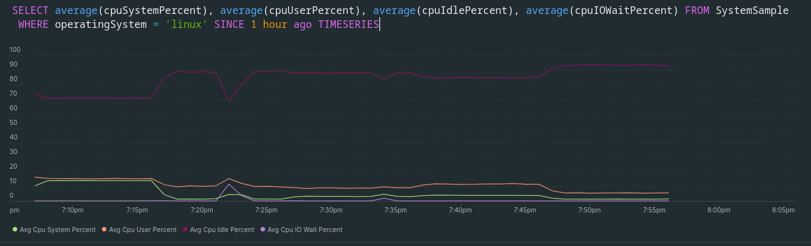
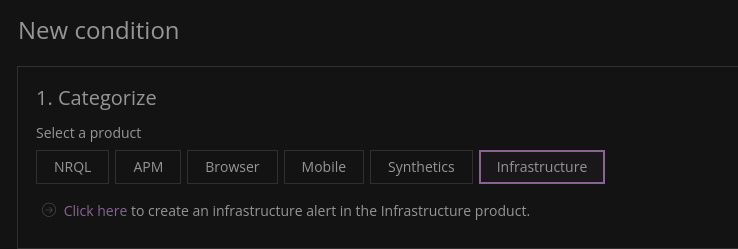
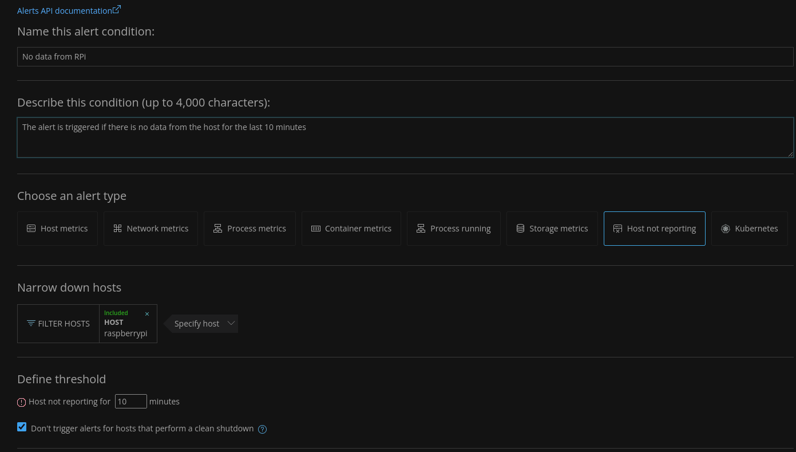
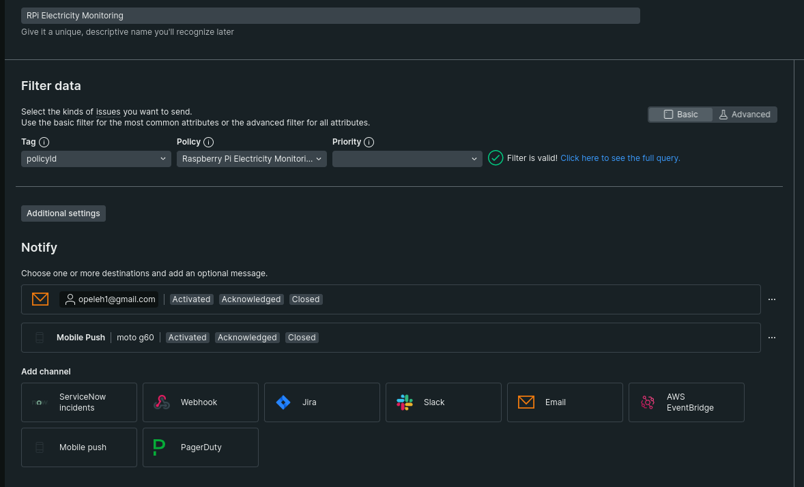
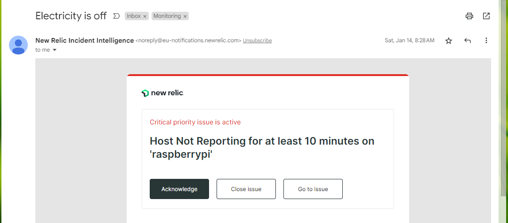
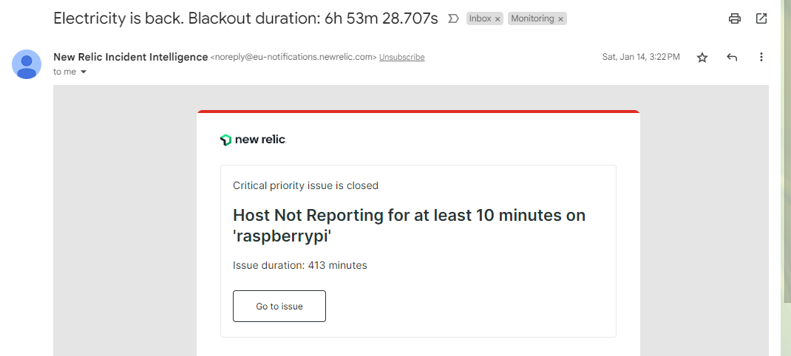
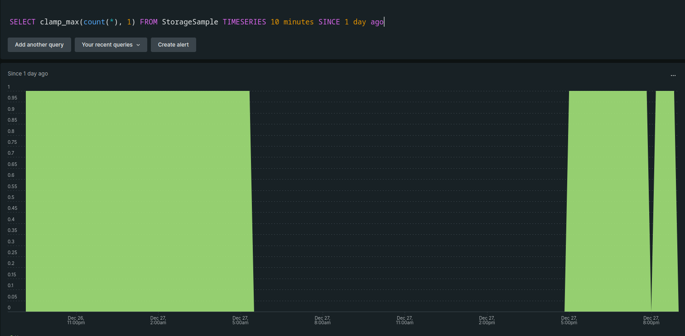

+++
author = "Oleh P"
title = "Monitoring the electricity availability at home with RaspberryPi and New Relic"
date = "2023-06-18"
description = "A short story about how I monitored the availability of electricity at home with RPi and New Relic during the blackouts caused by Russia's attacks on Ukraine's energy infrastructure"
tags = [
    "newrelic",
    "raspberry pi",
    "monitoring"
]
categories = [
    "Monitoring"
]
image = "elctricity-monitoring-with-rpi-nr.jfif"
+++

In the winter of 2022/23, Russia's shelling of Ukraine's energy infrastructure led to long-lasting power outages.
In addition to discomfort in everyday life, this also caused inconvenience in work. Of course, everyone already knows how to access the Internet when there is no electricity: you can power your laptop and router from a power bank, run a generator, etc. But sometimes it's easier to just move to a friend's house on the next street who is lucky enough to be connected to a line that powers critical infrastructure. Or move into an office or coworking space. 

But no matter how comfortable your friend's office/coworking space/cafe is, it's still more convenient to work from your favorite chair at home, from the place you started setting up when the COVID lockdown began. But how do you know if the power has been restored at home?

This is where the Raspberry Pi 3b came in handy, which I bought a few years ago to deploy a home assistant. For several years now, it had been lying idle (except for the fact that from time to time small home projects were run on it). So I had the idea to track its online status. To do this, I decided to use New Relic, one of the most powerful cloud-based monitoring platforms. Which, among other things, has a great free plan.


To monitor the Raspberry Pi, you first need to create an account with New Relic and install the Infrastructure Agent.

## How to install New Relic Infrastructure Agent
To install the NR Infrastructure Agent, log in to the host via ssh.

We will install and configure it according to the instructions from https://docs.newrelic.com/docs/infrastructure/install-infrastructure-agent/linux-installation/tarball-assisted-install-infrastructure-agent-linux/

1. Go to https://download.newrelic.com/infrastructure_agent/binaries/linux/ and download the version that suits our architecture (ARM in my case)

```bash
sudo curl https://download.newrelic.com/infrastructure_agent/binaries/linux/arm/newrelic-infra_linux_1.34.0_arm.tar.gz \
--output newrelic-infra_linux_1.34.0_arm.tar.gz
```

2. Unarchive
```bash
tar -xf newrelic-infra_linux_1.34.0_arm.tar.gz
```
3. Add [API key](https://docs.newrelic.com/docs/apis/intro-apis/new-relic-api-keys/) to the file `~/newrelic-infra/config_defaults.sh`
4. Run as administrator
```bash
sudo ~/newrelic-infra/installer.sh
```
5. Check if the agent is working
```bash
sudo systemctl status newrelic-infra
``` 

New Relic Infra Agent now collects data about the host's system resources and processes.

After that, you can see the monitored data in NR. For example, to see CPU usage statistics, you can run the following NRQL query:


```sql
SELECT average(cpuSystemPercent), average(cpuUserPercent), average(cpuIdlePercent), average(cpuIOWaitPercent) 
FROM SystemSample 
WHERE operatingSystem = 'linux' SINCE 1 hour ago TIMESERIES
```



## How to set up notifications

If the Raspberry Pi is turned on and connected to the network, New Relic receives information from it. If no data is received, it means we have no electricity. 

Let's set up a notification based on that assumption.

### Create Policy

1. **Alerts&AI → Alert conditions (Policies) → New Alert Policy**
2. Add a name and choose how to create incidents - **One issue per incident**.
3. Next -  **Create policy without notifications**

### Create Alert
1. Add conditions for creating incidents: **Create a condition**
2. Select the type - **Infrastructure** and follow the link below



3. The page with alert settings opens in the Infrastructure section. 
    
    Enter the name of the alert and optionally a description.
    
    - **Choose an alert type → Host not Reporting**.
    - Narrow down hosts - select the host to be monitored
    - Define threshold -** 10
    - **Violation time limit** - 72

    Next - **Create**

    

### Create Workflow

1. Go **Alerts&AI → Alert conditions (Policies) → Workflows → Add a workflow**.
2. Add a name
3. Select the Policy for which we are setting up the workflow
4. Add a channel to which notifications will be sent - **Email**.
5. Select the email to which notifications will be sent
    
    Subject line:

 ```
Electricity is{{#if closedAt}} back. Blackout duration: {{issueDurationText}} {{else}} off {{/if}}
 ```

6. To make sure that everything works - **Send test notification**.
7. I also added **Mobile Push** to see notifications on my mobile.
8. After all the settings, the workflow looks like this:



9. **Activate workflow** to save all changes and start receiving notifications

_New Relic is constantly working on updates, so if you have trouble setting up, or if the interface is different from the screenshots I've shown, please check out the [official documentation](https://docs.newrelic.com/docs/alerts-applied-intelligence/new-relic-alerts/)_.


## Result

- Notification when there is a power outage


    
- Notification when power is restored


    
- You can make a separate graph to track the availability of electricity at home



1. False Positive Alert: there is no Internet connection because of some issues onthe the ISP side, but there is electricity in the house. 

    I don't recall ever having this situation. But in the event of such an occurrence, it would be impossible to work since there is no internet connection in the house.
2. False Negative Alert: there is no electricity from the supplier, but there is a generator or charging station and an Internet connection. 
    
    In this case, the alert will not affect our workflows in any way, since we can assume that we are already aware of the problem since we have started the generator/connected the charging station. And it is important that the board is not powered by a backup source.


*Featured image of this page was generated using Microsoft Bing Image Creator*
