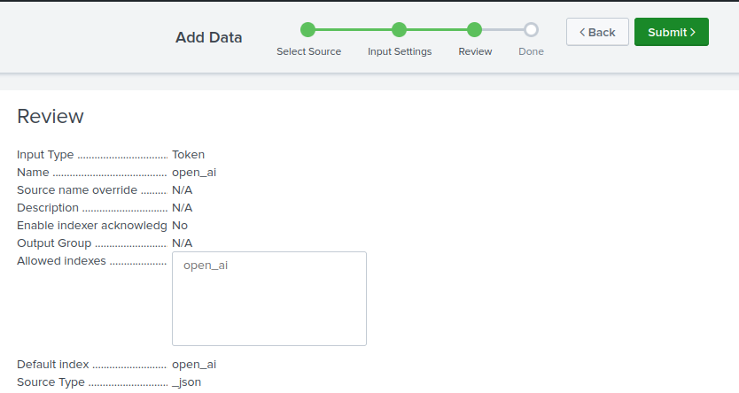
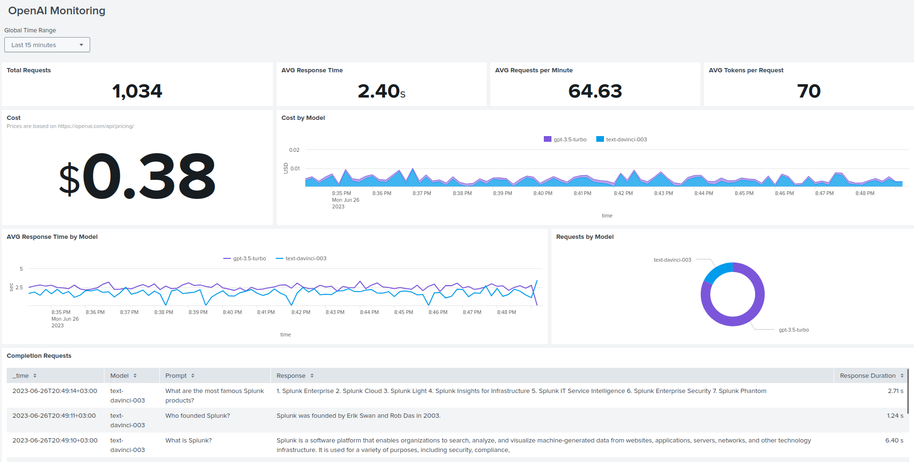
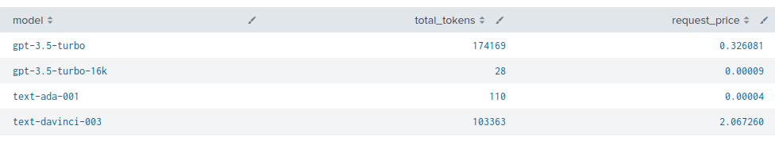

+++
author = "Oleh P"
title = "Monitoring OpenAI API with Splunk"
date = "2023-06-27"
description = "Discover how to effectively monitor and optimize OpenAI API calls using Splunk"
tags = [
    "open ai",
    "splunk",
    "monitoring"
]
categories = [
    "Monitoring"
]
draft = false
image = "img/cover.jpeg"
+++

[GitHub Repository](https://github.com/pelekh-o/openai-splunk-monitoring/)

The OpenAI API is a powerful tool that enables developers to integrate state-of-the-art natural language processing capabilities into their applications. As the usage of the OpenAI API grows, it becomes essential to monitor and track the API calls for various reasons. In this blog post, we will explore why monitoring OpenAI API calls is important and how you can leverage Splunk, a leading data analysis and monitoring platform, to accomplish this task effectively.

## Why Monitor OpenAI API Calls?

Monitoring API calls allows you to gain insights into how your application interacts with the OpenAI API. By analyzing usage patterns and trends, you can optimize your API requests, fine-tune parameters, and improve overall performance and efficiency.


## Splunk for OpenAI API Monitoring

With Splunk, you can collect, index, and visualize data from various sources, including API logs, performance metrics, and cost calculations. By using Splunk's powerful features, such as dashboards, alerts, and reports, you can gain actionable insights, make data-driven decisions, and ensure optimal usage of the OpenAI API.

In the following sections, I will walk you through the process of setting up OpenAI API monitoring with Splunk, including configuration steps, cost calculations, dashboard creation, and the use of monkey patching techniques.

Let's dive in!

## Getting Started 

_Note: Remember to refer to the original readme file from the [openai-splunk-monitoring GitHub Repo](https://github.com/pelekh-o/openai-splunk-monitoring/)
for complete instructions and code details._

Disclaimer: The sample code and instructions provided in this blog post are for illustrative purposes only. Always review and adapt them to meet your specific requirements and security practices.

### Step 1: Configure Splunk HEC
- Create a new index `open_ai`.
- Configure a new HEC: `Settings -> Data Inputs -> HTTP Event Collector -> + Add new`.
- Set name, e.g. `open_ai`.
- Select sourcetype `_json` and default index - `open_ai`.
- Review configurations.
    
- Copy your Token Value.
- Submit.

### Step 2: Create Lookup
Create a lookup table using the provided `openai_prices.csv` file.
- Go to `Settings -> Lookups` and click `+ Add new` under the `Lookup table files`.
- Upload `openai_prices.csv` file and save.
- Change permissions from `Private` to Global or App.
- Now go back to Looukups and a add new  `Lookup definition`.
- Name: `openai_prices`.
- Select the file that was previously uploaded `openai_prices.csv`.
- Check `Advanced options` and `WILDCARD(model)` to the `Match type` field.
- Save.

### Step 3: Configure your code
- Set your environment variables 
    - `SPLUNK_HEC_URL` (e.g., https://localhost:8088/services/collector)
    - `SPLUNK_HEC_TOKEN` (from [Step 1: Configure Splunk HEC](#step-1-configure-splunk-hec))
    - `OPENAI_API_KEY` (get it here: https://platform.openai.com/account/api-keys)
- Add `openai_splunk_monitor.py` file from the [openai-splunk-monitoring](https://github.com/pelekh-o/openai-splunk-monitoring) git repo.
- Add the following lines to your code:
```python
from openai_splunk_monitor import init_monitor
init_monitor()
```
### Step 4: Add dashboard
- To visualize the collected data, we create a custom dashboard in Splunk's Dashboard Studio. Simply import the code from `dashboard.json` into your Splunk instance




## Cost Calculation
The calculation of the funds spent is performed in Splunk by using the lookup that was created in [Step 2: Create Lookup](#step-2-create-lookup).

Here is an example SPL to calculate the cost per model
```
index="open_ai"
| rename response.usage.* as *, request.model as model
| lookup openai_prices model OUTPUTNEW price_prompt, price_competition
| eval price_prompt = mvindex(price_prompt, 0)
| eval price_competition = mvindex(price_competition, 0)
| eval request_price = (price_prompt * prompt_tokens + price_competition * completion_tokens)/1000
| stats sum(total_tokens), sum(request_price) by model
| rename sum(*) as *
```



## Monkey Patching
To capture response metrics and other relevant data, we employ monkey patching. Monkey patching is a technique that allows us to modify the behavior of the Completion call dynamically during runtime. By applying this technique, we can collect the necessary information and send it to Splunk for further analysis.
