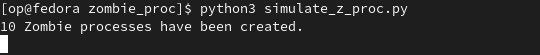
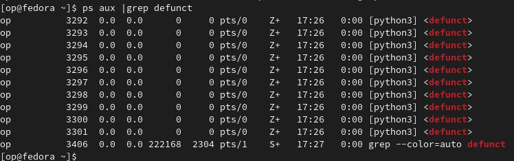
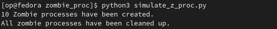
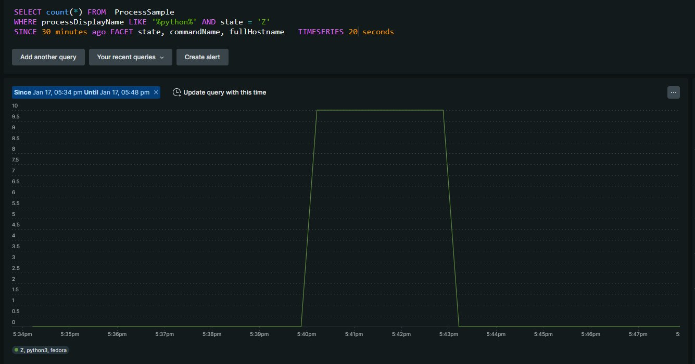

+++
author = "Oleh Pelekh"
title = "Monitoring Zombie Processes in Linux with New Relic"
date = "2024-01-17"
description = "Explore how to optimize your Linux system's performance by effectively monitoring and managing zombie processes using New Relic"
tags = [
    "newrelic",
    "linux",
    "python"
]
categories = [
    "Monitoring"
]
image = "img/cover.jpg"
+++

## Background of Zombie Processes in Linux


In Linux, a zombie process is a dead child process that hasn't been fully removed because its parent process hasn't acknowledged its termination. Think of it as a ghost holding onto its process table entry.

- **What are process states?** A process can be running, sleeping, stopped, or a zombie.
- **How are zombies created?** When a child finishes but the parent doesn't clean it up (call `wait()`).
- **What do zombies do?** They hog process table entries but don't use other resources.
- **Are zombies bad?** Not usually, unless they build up and start causing resource issues.
- **How do I deal with zombies?** Make sure parent processes call `wait()` to clean up their children.

## Importance of Monitoring Zombie Processes

While individual zombie processes are usually harmless on their own, monitoring them is still important for several reasons:

- While zombies themselves don't use much resources, a large accumulation can occupy valuable entries in the process table. This can limit the number of new processes that can be created, potentially impacting system performance.
- In extreme cases, if the process table reaches its maximum capacity due to excessive zombies, legitimate processes may even be forced to terminate, leading to crashes and instability.
- In rare cases, compromised zombie processes can be exploited by attackers to gain unauthorized access to the system. This is because the exit status of a zombie isn't necessarily known, potentially hiding malicious activity within the "dead" process.

Monitoring zombies provides insights into the overall health and stability of the system. A sudden increase in the number of zombies could indicate problems with specific applications or underlying system issues.

## Configuring New Relic Infrastructure Agent to monitor zombie processes

We need New Relic Infrastruncture installed on monitored Linux host. You can install it from [here](https://docs.newrelic.com/docs/infrastructure/install-infrastructure-agent/get-started/install-infrastructure-agent/).

Open `/etc/newrelic-infra.yml` and add  the following parameters:

```yaml
enable_process_metrics: true
disable_zero_mem_process_filter: true
```

Save the file and restart New Relic infrastructure agent service:

```bash
sudo systemctl restart newrelic-infra.service
```

## Simulating Zombie Processes with Python

Now let’s simulate zombie processes using Python.

Create python file with the following code:

```python
import os, time, sys

time_to_sleep = 180 # sleep 3 mins

def create_zombie():
    pid = os.fork() # create child process
    if pid > 0:
        return # if PID is greater than 0, parent process will return,
                # leaving the child process hanging and becoming a zombie.
    else:
        sys.exit(0) # child process exits here

if __name__ == "__main__":
    for i in range(10): # create 10 zombie processes
        create_zombie()
    print("10 Zombie processes have been created.")
    time.sleep(time_to_sleep)
    while True:
        try:
            os.wait()
        except ChildProcessError: # if there is no more child processes, break the loop
            break
    print("All zombie processes have been cleaned up.")
```

Run it with `python3 simulate_z_proc.py`:



Zombie processes were created. Let’s check them. Run `ps aux | grep defunct` in terminal. The output should be as follows:



After 3 minutes all the child processes will be killed:



Now let’s check Zombie processes data in New Relic. Run the following NRQL query:
```sql
SELECT count(*) FROM  ProcessSample
WHERE processDisplayName LIKE '%python%' AND state = 'Z'
SINCE 1 hour ago FACET state, commandName, fullHostname TIMESERIES AUTO
```


## Final Thoughts

- Monitoring zombie processes is essential for proactive system management, even though individual zombies may seem harmless.
- Look for abnormally high amounts of zombies, which can signal resource issues, masked system problems, or potential security vulnerabilities.
- Implementing proper parent process cleanup practices and using monitoring tools can help prevent zombie build-up and maintain system health.

## References

1. What is Zombie Process in Linux? **-** [https://www.scaler.com/topics/zombie-process-in-linux/](https://www.scaler.com/topics/zombie-process-in-linux/)
2. Install the infrastructure agent - [https://docs.newrelic.com/docs/infrastructure/install-infrastructure-agent/get-started/install-infrastructure-agent/](https://docs.newrelic.com/docs/infrastructure/install-infrastructure-agent/get-started/install-infrastructure-agent/)
3. New Relic infrastructure agent configuration file example - [https://github.com/newrelic/infrastructure-agent/blob/master/assets/examples/infrastructure/newrelic-infra-template.yml.example](https://github.com/newrelic/infrastructure-agent/blob/master/assets/examples/infrastructure/newrelic-infra-template.yml.example)
4. Creating & troubleshooting Zombie processes in Python ****-**** [https://medium.com/naukri-engineering/creating-troubleshooting-the-zombie-process-in-python-f4d89c46a85a](https://medium.com/naukri-engineering/creating-troubleshooting-the-zombie-process-in-python-f4d89c46a85a)


Cover image generated with [fotor.ai](https://www.fotor.com/ai-image-generator/)