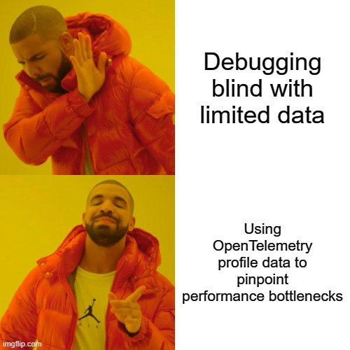

+++
author = "Oleh Pelekh"
title = "O11y Weekly - 2024-06-03"
date = "2024-06-03"
description = "Observaility&Monitoring Digest is back! This week's digest: OpenTelemetry gets a performance boost, dashboards as communication tools, & keeping your Cloud SIEM sharp."
tags = [
    "o11y"
]
categories = [
    "o11y-weekly"
]
draft = false
+++

[**Metrics, Traces, Logs — And Now, OpenTelemetry Profile Data**](https://thenewstack.io/metrics-traces-logs-and-now-opentelemetry-profile-data/)

Discover the latest enhancement in OpenTelemetry with the addition of profiling data to metrics, traces, and logs. This new capability allows to gain deeper insights into application performance and resource usage, facilitating comprehensive root cause analysis and optimization. Learn how profiling integrates with existing telemetry to provide a more robust and unified observability framework.

[**Dashboards are like Plans**](https://www.observeinc.com/blog/dashboards-are-like-plans/)

Discover how dashboards are like plans in this intriguing article from Observe, Inc. Learn why their true value lies in the creation process, the importance of continuous updates, and how they serve as essential tools for both situational awareness and detailed data analysis. Dive into the nuances that make dashboards effective and keep your team engaged.

[**Deep dive into observability of Messaging Queues with OpenTelemetry**](https://signoz.io/blog/kafka-monitoring-opentelemetry/)

Explore how to enhance Kafka monitoring using OpenTelemetry in this insightful blog post from SigNoz. Learn how to trace the complete path of messages from producers to consumers, address common debugging scenarios like high consumer lag, and improve Kafka's reliability and performance through deep visibility and comprehensive metrics.

[**What’s going on? The power of normalization in Cloud SIEM**](https://www.sumologic.com/blog/whats-going-on-normalization-cloud-siem/)

The article on Sumo Logic's blog discusses the critical role of normalization in cloud SIEM (Security Information and Event Management) systems. It delves into how normalization improves data quality and consistency, which is essential for accurate threat detection and streamlined incident response.

[**Grafana OnCall: Use the new bi-directional ServiceNow integration for seamless alert flows**](https://grafana.com/blog/2024/05/28/grafana-oncall-use-the-new-bi-directional-servicenow-integration-for-seamless-alert-flows/)

This is an article about the new Grafana OnCall's bi-directional ServiceNow integration that allows alerts to flow between Grafana OnCall and ServiceNow. It shows what it is and the benefits of using it along with details on how to configure it.
